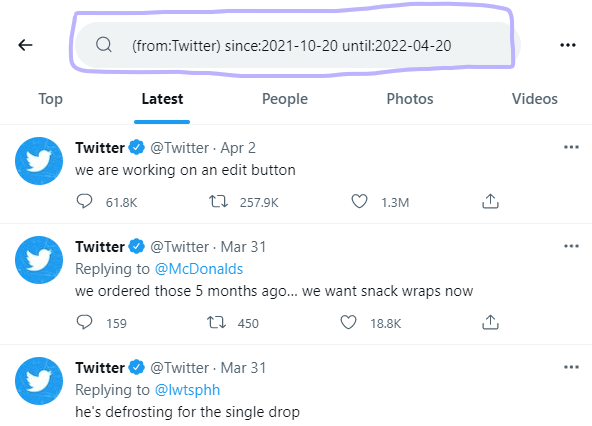
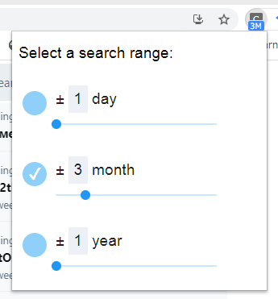

# Nearby Tweet
An extension for Google Chrome to search nearby tweets quickly within a specific time range pivoting around the selected tweet.
```
           <----------------- tweet ----------------->
+3days after                    0                    -3days before
```

## Usage
1. Select a tweet.
2. Right click on the tweet and select a "Nearby Tweet" option.


3. Then a new tab with a search query will open.



You can specify a time range via an extension icon.




## License
MIT
